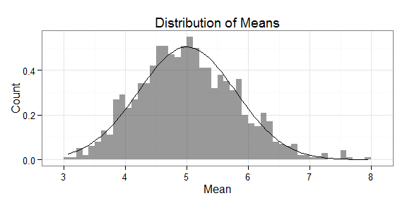

# Investigating the exponential distribution
Leon Duplay  
15 July 2015  

<style type="text/css">
h2,h3,h4,h5,h6{
  font-size: 14pt;
}
</style>

## Overview

In this document, we will investigate the exponential distribution in R using the Central Limit Theorem.  One key feature of the exponential distribution is that both the mean and standard deviation correspond to `1/lambda`.

In order to investigate the exponential distribution in R, we will simulate data and perform the following tasks:

1. Analyze the sample mean and compare it to the theoretical mean of the distribution according to its definition.
2. Analyze how variable the sample is (via variance) and compare it to the theoretical variance of the distribution.
3. Demonstrate that the distribution is approximately normal, focusing on the difference between the distribution of a large collection of random exponentials and the distribution of a large collection of averages of 40 exponentials.

Below you can see an example of the exponential distribution probability density function:


```r
# Show a demo of the exponential distribution
library(ggplot2)
x <- seq(0.0,10.0,0.01)
qplot(x,dexp(x,0.2),geom="line",main="Exponential distribution example for lambda = 0.2")
```


## Simulations

In this first part, we will simulate the needed data using `rexp(n, lambda)`. We fix the value $lambda = 0.2$, and start with $n = 40$ samples. We will perform $nosims = 1000$ experiments. As explained above, the theoretical mean and standard deviation of the distribution is 1/lambda, i.e. 5.


```r
# Initialize parameters
set.seed(11111)
nosims <- 1000
n <- 40
lambda <- 0.2
mean_theoretical <- 1/lambda
sd_theoretical <- 1/lambda

# Simulation
means_simulated <- NULL
for (i in 1: nosims) {
        means_simulated <- c(means_simulated, mean(rexp(n, lambda)))
}
```

## Sample Mean versus Theoretical Mean

According to the Central Limit Theorem, with our large number of simulations (1000), we can say: $$\frac{\mbox{Estimate} - \mbox{Mean of Estimate}}{\mbox{Std. Err. of Estimate}} = \frac{\bar X_n - \mu}{\sigma / \sqrt{n}}=\frac{\sqrt n (\bar X_n - \mu)}{\sigma} \longrightarrow N(0, 1)$$
This translates to the distribution of the sample mean $\bar X_n$ is approximately $N(\mu, \sigma^2/n)$, with:

* distribution is centered at the population mean
* with standard deviation = standard error of the mean
	
Therefore, we will check if the calculated mean of our average sample exponentials is equal to the theoretical mean 1/lambda, and plot the data with the resulting means below.


```r
# Calculate experimental means
mean_experimental <- mean(means_simulated)

# Plot data & means
g <- ggplot() + theme_bw() + ggtitle("Simulated data with expected and experimental means") + 
        geom_histogram(aes(x=means_simulated),binwidth=0.1) +
        geom_vline(xintercept = mean_experimental, colour = "green", size=1.5) + 
        geom_vline(xintercept = mean_theoretical, colour = "blue", size=1.5)
g
```


The experimental mean (green) is **5.0206735**, very close to our expected theoretical (blue) value of **5**, showing that the CLT is indeed valid for our system.

## Sample Variance versus Theoretical Variance

In the same way as the mean, according to the CLT we expect the standard deviation of our average sample of exponentials to be equal to the standard error of the mean. We calculate here the expected stand error of the mean and the experimental value, then compare the two in the graph below.


```r
# Calculate expected standard error of the mean squared
SEM2_theoretical <- (sd_theoretical)^2/n
# Calculate true variance
SEM2_experimental <- var(means_simulated)
```

The expected standard error of the mean squared, and therefore variance of our distribution of samples is **0.625**. The experimental variance is **0.6304973**, which is very close to the expected value, showing the CLT is indeed valid for our system.

## Distribution

By overlaying our experimental simulated data with the normal curve defined by `mean = 1/lambda` and `std = standard error of the mean` as shown previously, we get the curve below:


```r
g2 <- ggplot() + theme_bw() + aes(means_simulated) + 
    geom_histogram(aes(y=..density..), alpha = 0.5, binwidth=0.1) +
    stat_function(fun=dnorm, args=list(mean=mean_theoretical, sd=mean_theoretical/sqrt(n))) + 
    labs(title="Distribution of Means", x="Mean", y="Count")
g2
```



The fit shows that the CLT can indeed be applied and we have calculated correct means and variances. Therefore, we can conclude that the exponential distribution converges to a normal distribution over a large number of simulations, according to the central limit theorem.

## Appendix

This analysis was completed with the below system:


```r
sessionInfo()
```

```
## R version 3.1.3 (2015-03-09)
## Platform: x86_64-w64-mingw32/x64 (64-bit)
## Running under: Windows 7 x64 (build 7601) Service Pack 1
## 
## locale:
## [1] LC_COLLATE=English_United Kingdom.1252 
## [2] LC_CTYPE=English_United Kingdom.1252   
## [3] LC_MONETARY=English_United Kingdom.1252
## [4] LC_NUMERIC=C                           
## [5] LC_TIME=English_United Kingdom.1252    
## 
## attached base packages:
## [1] stats     graphics  grDevices utils     datasets  methods   base     
## 
## other attached packages:
## [1] ggplot2_1.0.1
## 
## loaded via a namespace (and not attached):
##  [1] colorspace_1.2-6 digest_0.6.8     evaluate_0.7     formatR_1.2     
##  [5] grid_3.1.3       gtable_0.1.2     htmltools_0.2.6  knitr_1.10.5    
##  [9] labeling_0.3     magrittr_1.5     MASS_7.3-42      munsell_0.4.2   
## [13] plyr_1.8.3       proto_0.3-10     Rcpp_0.11.6      reshape2_1.4.1  
## [17] rmarkdown_0.7    scales_0.2.5     stringi_0.5-5    stringr_1.0.0   
## [21] tools_3.1.3      yaml_2.1.13
```
