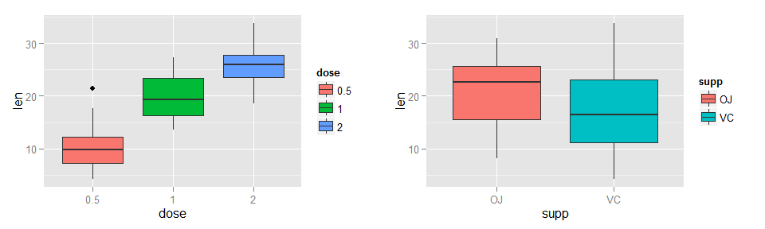
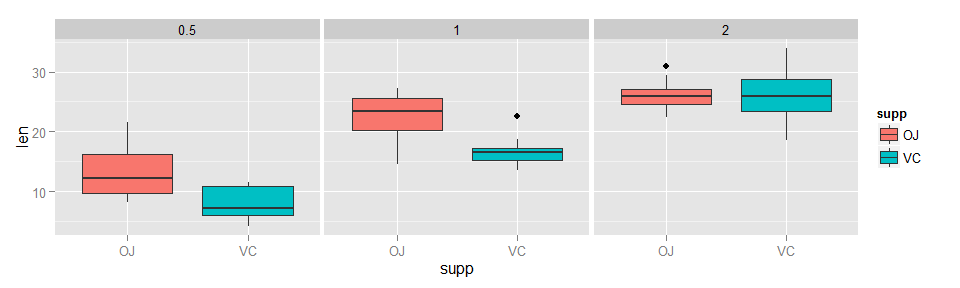

# Tooth Growth dataset analysis
Leon Duplay  
16 July 2015  

## Overview

In this document, we will investigate the ToothGrowth by performing some basic exploratory data analysis and some statistical inference. By using confidence intervals and/or hypothesis tests to compare tooth growth by `supp` and `dose`, we will study the impact of these two variables on tooth growth and present our conclusions, including the assumptions made.

## Exploring the dataset

In this section, we will load the ToothGrowth dataset and perform some exploratory data analysis, before performing our hypothesis testing in the next section.


```r
# Libraries
library(datasets)
library(ggplot2)
library(grid)
library(gridExtra)

# Load data & basic data info
data(ToothGrowth)
ToothGrowth$dose <- as.factor(ToothGrowth$dose)
summary(ToothGrowth)
```

```
##       len        supp     dose   
##  Min.   : 4.20   OJ:30   0.5:20  
##  1st Qu.:13.07   VC:30   1  :20  
##  Median :19.25           2  :20  
##  Mean   :18.81                   
##  3rd Qu.:25.27                   
##  Max.   :33.90
```

The data represents 60 observations, with the length of teeth in each of 10 guinea pigs after following three dose levels of Vitamin C (0.5, 1 and 2 mg) with each of two delivery methods (orange juice OJ or ascorbic acid AC).

We'll now explore the data using some simple boxplots to get an idea if `supp` and `dose` have an impact on tooth length and in which way.


```r
# Plot length vs dose & supp
g1 <- ggplot(aes(x = dose, y = len), data = ToothGrowth) + geom_boxplot(aes(fill = dose))
g2 <- ggplot(aes(x = supp, y = len), data = ToothGrowth) + geom_boxplot(aes(fill = supp))
grid.arrange(g1, g2, ncol=2)
```



```r
ggplot(aes(x = supp, y = len), data = ToothGrowth) + 
    geom_boxplot(aes(fill = supp)) + facet_wrap(~ dose)
```



In the graphs above, we can see a clear trend: the larger the dosage, the longer the tooth. However, the effectiveness of delivery method is not clear, both OJ and VC have roughly the same performance (with OJ having a slightly higher mean).

Looking at both variables together gives an interesting insight: it seems that at lower doses OJ is more effective than VC in terms of tooth length, but at high dosage (2mg), the performance is the same.

## Confidence Intervals and Hypothesis Testing

The next two sections are for analyzing the data for correlation between the delivery method (Dosage and Supplement) and change in tooth growth. 

### 3.1 Dosage as a Factor


```r
    dose1 <- subset(ToothGrowth, dose %in% c(0.5, 1.0))
    dose2 <- subset(ToothGrowth, dose %in% c(0.5, 2.0))
    dose3 <- subset(ToothGrowth, dose %in% c(1.0, 2.0))
    t.test(len ~ dose, paired = F, var.equal = F, data = dose1)
```

```
## 
## 	Welch Two Sample t-test
## 
## data:  len by dose
## t = -6.4766, df = 37.986, p-value = 1.268e-07
## alternative hypothesis: true difference in means is not equal to 0
## 95 percent confidence interval:
##  -11.983781  -6.276219
## sample estimates:
## mean in group 0.5   mean in group 1 
##            10.605            19.735
```


```r
    t.test(len ~ dose, paired = F, var.equal = F, data = dose2)
```

```
## 
## 	Welch Two Sample t-test
## 
## data:  len by dose
## t = -11.799, df = 36.883, p-value = 4.398e-14
## alternative hypothesis: true difference in means is not equal to 0
## 95 percent confidence interval:
##  -18.15617 -12.83383
## sample estimates:
## mean in group 0.5   mean in group 2 
##            10.605            26.100
```


```r
    t.test(len ~ dose, paired = F, var.equal = F, data = dose3)
```

```
## 
## 	Welch Two Sample t-test
## 
## data:  len by dose
## t = -4.9005, df = 37.101, p-value = 1.906e-05
## alternative hypothesis: true difference in means is not equal to 0
## 95 percent confidence interval:
##  -8.996481 -3.733519
## sample estimates:
## mean in group 1 mean in group 2 
##          19.735          26.100
```

The confidence intervals ([-11.98, -6.276] for doses 0.5 and 1.0, [-18.16, -12.83] for doses 0.5 and 2.0, and [-8.996, -3.734] for doses 1.0 and 2.0) allow for the rejection of the null hypothesis and a confirmation that there is a significant correlation between tooth length and dose levels.

### 3.2 Supplement as a Factor

Analyzing the data for correlation between the delivery method and change in tooth growth:


```r
    t.test(len ~ supp, paired = F, var.equal = F, data = ToothGrowth)
```

```
## 
## 	Welch Two Sample t-test
## 
## data:  len by supp
## t = 1.9153, df = 55.309, p-value = 0.06063
## alternative hypothesis: true difference in means is not equal to 0
## 95 percent confidence interval:
##  -0.1710156  7.5710156
## sample estimates:
## mean in group OJ mean in group VC 
##         20.66333         16.96333
```

A confidence interval of [-0.171, 7.571] does not allow us to reject the null hypothesis (that there is no correlation between delivery method and tooth length).

## 4. Conclusions and Assumptions

### 4.1 Assumptions

In order to make conclusions with the data in this dataset, we must assume the following:

1. The poplulations are independent, the variances between populations are different and a random population was used
2. The population was comprised of similar guinea pigs, measurement error was accounted for with significant digits, and double blind research methods were used. 
3. For the populations to be independent, 60 guinea pigs would have to be used so each combination of dose level and delivery method were not affected by the other methods. 
4. To ensure double blind research methods are followed, the researchers taking the measurements must have been unaware of which guinea pigs were given which dose level or delivery method. 
5. The guinea pigs must also be unaware that they are being given a specific treatment.

## Conclusions

1. Supplement type has no effect on tooth growth.
2. Increasing the dose level leads to increased tooth growth.

## Appendix

This analysis was completed with the below system:


```r
sessionInfo()
```

```
## R version 3.1.3 (2015-03-09)
## Platform: x86_64-w64-mingw32/x64 (64-bit)
## Running under: Windows 7 x64 (build 7601) Service Pack 1
## 
## locale:
## [1] LC_COLLATE=English_United Kingdom.1252 
## [2] LC_CTYPE=English_United Kingdom.1252   
## [3] LC_MONETARY=English_United Kingdom.1252
## [4] LC_NUMERIC=C                           
## [5] LC_TIME=English_United Kingdom.1252    
## 
## attached base packages:
## [1] grid      stats     graphics  grDevices utils     datasets  methods  
## [8] base     
## 
## other attached packages:
## [1] gridExtra_0.9.1 ggplot2_1.0.1  
## 
## loaded via a namespace (and not attached):
##  [1] colorspace_1.2-6 digest_0.6.8     evaluate_0.7     formatR_1.2     
##  [5] gtable_0.1.2     htmltools_0.2.6  knitr_1.10.5     labeling_0.3    
##  [9] magrittr_1.5     MASS_7.3-42      munsell_0.4.2    plyr_1.8.3      
## [13] proto_0.3-10     Rcpp_0.11.6      reshape2_1.4.1   rmarkdown_0.7   
## [17] scales_0.2.5     stringi_0.5-5    stringr_1.0.0    tools_3.1.3     
## [21] yaml_2.1.13
```
