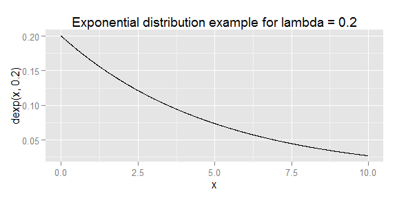

# Tooth Growth dataset analysis
Leon Duplay  
16 July 2015  

## Overview

In this document, we will investigate the exponential distribution in R using the Central Limit Theorem.  One key feature of the exponential distribution is that both the mean and standard deviation correspond to `1/lambda`.

In order to investigate the exponential distribution in R, we will simulate data and perform the following tasks:

1. Analyze the sample mean and compare it to the theoretical mean of the distribution according to its definition.
2. Analyze how variable the sample is (via variance) and compare it to the theoretical variance of the distribution.
3. Demonstrate that the distribution is approximately normal, focusing on the difference between the distribution of a large collection of random exponentials and the distribution of a large collection of averages of 40 exponentials.

Below you can see an example of the exponential distribution probability density function:


```r
# Show a demo of the exponential distribution
library(ggplot2)
x <- seq(0.0,10.0,0.01)
qplot(x,dexp(x,0.2),geom="line",main="Exponential distribution example for lambda = 0.2")
```



Now in the second portion of the class, we're going to analyze the ToothGrowth data in the R datasets package. 
Load the ToothGrowth data and perform some basic exploratory data analyses 
Provide a basic summary of the data.
Use confidence intervals and/or hypothesis tests to compare tooth growth by supp and dose. (Only use the techniques from class, even if there's other approaches worth considering)
State your conclusions and the assumptions needed for your conclusions. 
Some criteria that you will be evaluated on
Did you  perform an exploratory data analysis of at least a single plot or table highlighting basic features of the data?
Did the student perform some relevant confidence intervals and/or tests?
Were the results of the tests and/or intervals interpreted in the context of the problem correctly? 
Did the student describe the assumptions needed for their conclusions?

## Appendix

This analysis was completed with the below system:


```r
sessionInfo()
```

```
## R version 3.1.3 (2015-03-09)
## Platform: x86_64-w64-mingw32/x64 (64-bit)
## Running under: Windows 7 x64 (build 7601) Service Pack 1
## 
## locale:
## [1] LC_COLLATE=English_United Kingdom.1252 
## [2] LC_CTYPE=English_United Kingdom.1252   
## [3] LC_MONETARY=English_United Kingdom.1252
## [4] LC_NUMERIC=C                           
## [5] LC_TIME=English_United Kingdom.1252    
## 
## attached base packages:
## [1] stats     graphics  grDevices utils     datasets  methods   base     
## 
## other attached packages:
## [1] ggplot2_1.0.1
## 
## loaded via a namespace (and not attached):
##  [1] colorspace_1.2-6 digest_0.6.8     evaluate_0.7     formatR_1.2     
##  [5] grid_3.1.3       gtable_0.1.2     htmltools_0.2.6  knitr_1.10.5    
##  [9] labeling_0.3     magrittr_1.5     MASS_7.3-42      munsell_0.4.2   
## [13] plyr_1.8.3       proto_0.3-10     Rcpp_0.11.6      reshape2_1.4.1  
## [17] rmarkdown_0.7    scales_0.2.5     stringi_0.5-5    stringr_1.0.0   
## [21] tools_3.1.3      yaml_2.1.13
```
